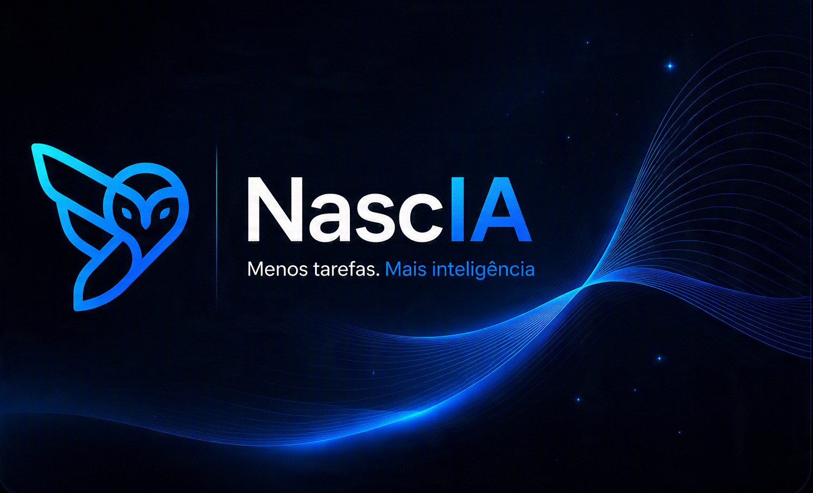
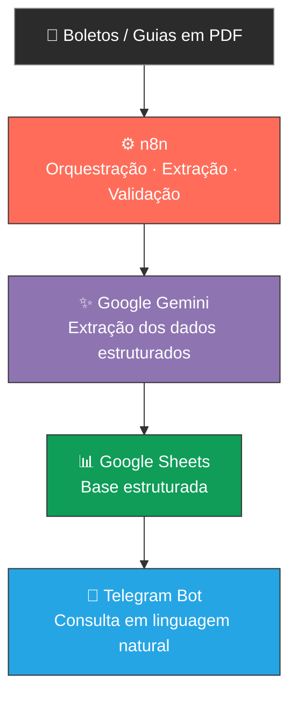
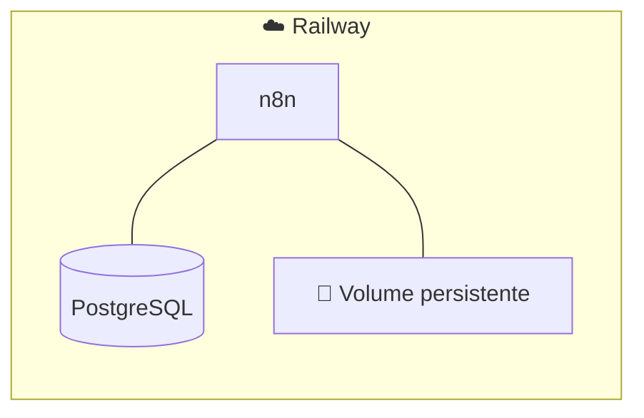
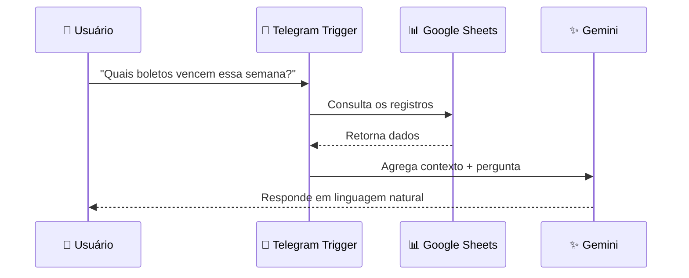
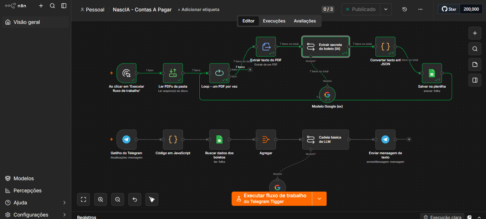
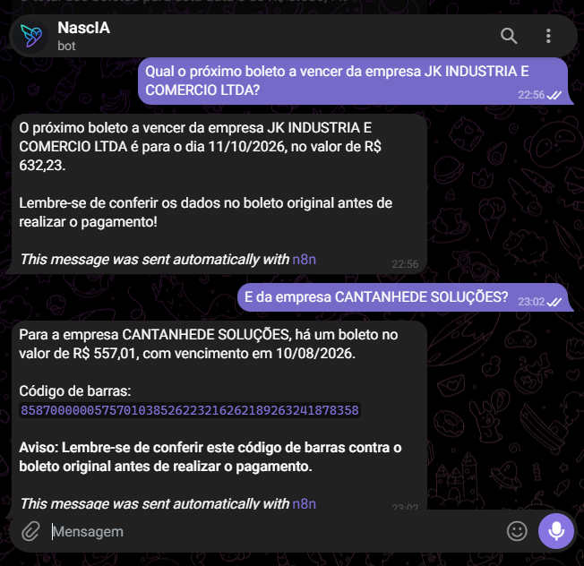
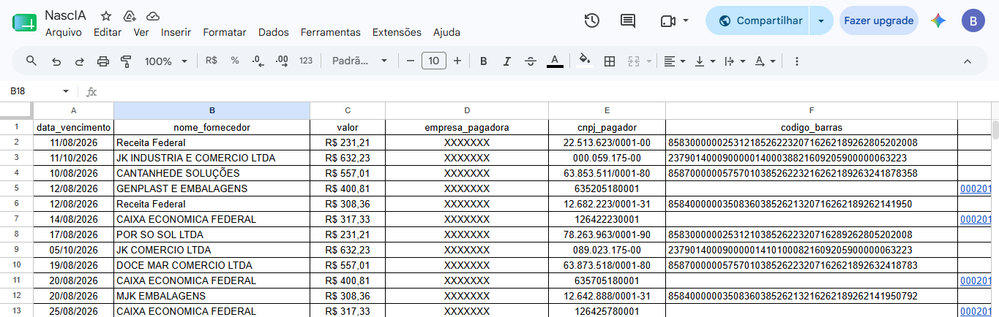

<div align="center">



# NascIA — Assistente de Boletos via IA

**Extração, validação e consulta inteligente de boletos e documentos de cobrança brasileiros**

[](https://n8n.io)
[](https://ai.google.dev)
[](https://core.telegram.org/bots)
[](https://railway.app)
[](https://www.postgresql.org)
[](./LICENSE)

**🟢 Projeto funcional em produção**

</div>

---

> [!NOTE]
> Os dados utilizados nas capturas, exemplos e testes publicados neste portfólio são **fictícios ou anonimizados** e não representam informações financeiras reais.

## 📑 Sumário

- [Objetivo do projeto](#-objetivo-do-projeto)
- [Arquitetura](#️-arquitetura)
- [Ambiente de produção](#️-ambiente-de-produção)
- [Fluxo 1 — Extração de boletos](#-fluxo-1--extração-e-processamento-de-boletos)
- [Fluxo 2 — Consulta via Telegram](#-fluxo-2--consulta-de-boletos-via-telegram)
- [Inteligência artificial](#-inteligência-artificial)
- [Decisões técnicas e cuidados](#-decisões-técnicas-e-cuidados)
- [Tecnologias utilizadas](#️-tecnologias-utilizadas)
- [Estrutura da planilha](#-estrutura-da-planilha)
- [Demonstração](#-demonstração)
- [Como executar localmente](#-como-executar-localmente)
- [Segurança](#-segurança)
- [Estrutura do repositório](#-estrutura-do-repositório)
- [Status do projeto](#-status-do-projeto)
- [Autor](#-autor)

---

## 🎯 Objetivo do projeto

O **NascIA** resolve um problema recorrente em rotinas financeiras: a necessidade de analisar boletos e documentos de cobrança individualmente para extrair informações como vencimento, fornecedor, valor e forma de pagamento.

Em vez de um processo manual, repetitivo e sujeito a erro, o NascIA usa inteligência artificial para extrair esses dados, aplica regras de validação e armazena tudo de forma estruturada — pronto para consulta.

| Campo extraído | Descrição |
|---|---|
| 📅 Data de vencimento | Quando o boleto vence |
| 🏢 Fornecedor / beneficiário | Quem recebe o pagamento |
| 💰 Valor | Valor numérico do documento |
| 🏦 Empresa pagadora | Sacado / quem deve pagar |
| 🆔 CNPJ/CPF | Documento do pagador |
| 🔢 Código de barras | Linha digitável |
| ⚡ PIX Copia e Cola | Quando disponível |

Depois de registrados, os dados ficam disponíveis para consulta via **bot no Telegram**, em linguagem natural:

> 💬 *"Quais boletos estão cadastrados?"*
> 💬 *"Quais vencem esta semana?"*
> 💬 *"Qual é o maior boleto?"*
> 💬 *"Quais boletos são da Caixa Econômica Federal?"*

---

## 🏗️ Arquitetura



<div align="center">

**Ambiente de produção**



</div>

---

## ☁️ Ambiente de produção

O NascIA possui uma instância do **n8n hospedada na Railway**, permanecendo disponível na nuvem sem depender de execução manual em máquina local.

<table>
<tr><td>☁️ <b>Railway</b></td><td>Hospedagem da aplicação</td></tr>
<tr><td>⚙️ <b>n8n</b></td><td>Orquestração dos workflows</td></tr>
<tr><td>🐘 <b>PostgreSQL</b></td><td>Banco de dados da instância do n8n</td></tr>
<tr><td>💾 <b>Volume persistente</b></td><td>Armazenamento da configuração e dados</td></tr>
<tr><td>📊 <b>Google Sheets</b></td><td>Armazenamento estruturado dos boletos</td></tr>
<tr><td>✨ <b>Google Gemini</b></td><td>Processamento com IA</td></tr>
<tr><td>🤖 <b>Telegram</b></td><td>Interface de interação com o usuário</td></tr>
</table>

**🔗 Instância publicada:** [n8n-production-3e2af.up.railway.app](https://n8n-production-3e2af.up.railway.app)

> [!TIP]
> O workflow **NascIA - Contas A Pagar** está publicado e foi validado em produção — o fluxo de consulta foi testado ponta a ponta:
>
> `Telegram → Telegram Trigger → JavaScript → Google Sheets → Agregação → Google Gemini → Telegram`
>
> Durante o teste, o workflow consultou os registros no Google Sheets e retornou a resposta automaticamente ao usuário.

---

## 🔄 Fluxo 1 — Extração e processamento de boletos

Responsável por transformar documentos de cobrança em dados estruturados.

| # | Etapa | O que acontece |
|---|---|---|
| 1 | 🖱️ Trigger manual | Inicia o processamento dos documentos disponíveis |
| 2 | 📂 Leitura dos PDFs | O n8n acessa os documentos e envia cada um para processamento |
| 3 | 🔁 Loop de processamento | Processa os arquivos individualmente, sem concorrência |
| 4 | 📝 Extração do texto | Extrai o conteúdo textual do PDF |
| 5 | ✨ Extração com IA | O Gemini interpreta o conteúdo e retorna os dados estruturados |
| 6 | ✅ Validação dos dados | Aplica regras de consistência sobre os campos extraídos |
| 7 | 🚨 Geração de alertas | Sinaliza campos ausentes ou suspeitos |
| 8 | 💾 Armazenamento | Grava a linha final no Google Sheets |

<details>
<summary><b>📦 Exemplo do JSON extraído</b></summary>

```json
{
  "data_vencimento": "20/08/2026",
  "nome_fornecedor": "Fornecedor Exemplo",
  "valor": "550.00",
  "empresa_pagadora": "Empresa Exemplo",
  "cnpj_pagador": "12345678000100",
  "codigo_barras": "12345678901234567890123456789012345678901234",
  "pix_copia_cola": null
}
```

</details>

**Validações aplicadas:**

- ✔️ Formatação e quantidade de dígitos do CNPJ/CPF
- ✔️ Validação matemática do dígito verificador (CNPJ e CPF)
- ✔️ Consistência da data de vencimento
- ✔️ Presença de fornecedor e valor
- ✔️ Tamanho do código de barras
- ✔️ Formato básico do PIX Copia e Cola
- ✔️ Inconsistências entre fornecedor e pagador

**Exemplos de alertas gerados automaticamente:**

```text
⚠️ Sem data de vencimento
⚠️ SEM FORNECEDOR - revisar PDF manualmente
⚠️ CNPJ do pagador com dígito verificador inválido
⚠️ Código de barras com tamanho incorreto
```

---

## 💬 Fluxo 2 — Consulta de boletos via Telegram

Transforma os dados armazenados em um assistente conversacional.



**Exemplo real de interação:**

<table>
<tr><td>

**👤 Usuário**
```text
Quais boletos estão cadastrados?
```

</td><td>

**🤖 NascIA**
```text
Aqui estão todos os boletos cadastrados:

1. Fornecedor A
   Vencimento: 12/08/2026
   Valor: R$ 450,00

2. Fornecedor B
   Vencimento: 15/08/2026
   Valor: R$ 720,00
```

</td></tr>
</table>

---

## 🤖 Inteligência artificial

O **Google Gemini** atua em dois momentos do projeto:

| Momento | Papel da IA |
|---|---|
| 📥 **Extração de documentos** | Interpreta o conteúdo textual do boleto e identifica os campos necessários |
| 💬 **Consulta em linguagem natural** | Interpreta a pergunta do usuário e monta a resposta com base nos dados recuperados |

O modelo nunca recebe apenas a pergunta isolada — o workflow primeiro recupera os dados relevantes e os agrega em contexto antes de gerar a resposta, evitando alucinações ou respostas fragmentadas.

---

## 🧠 Decisões técnicas e cuidados

> [!IMPORTANT]
> Informações financeiras não devem depender exclusivamente da interpretação de um modelo de IA.

- **🔐 Validação matemática de CNPJ/CPF** — os dígitos verificadores são recalculados para identificar erros de extração; a IA não é fonte de verdade absoluta para documentos críticos.
- **🚫 Nenhuma decisão de pagamento automática** — código de barras e PIX recebem sinalização específica para conferência manual antes de qualquer uso financeiro.
- **📅 Prevenção de datas inventadas** — regras explícitas impedem a IA de estimar ou usar a data atual como vencimento; campos incertos ficam `null` e recebem alerta.
- **🔀 Fornecedor vs. pagador** — o prompt diferencia claramente quem recebe (beneficiário) de quem paga (sacado), reduzindo o risco de inversão.
- **🧩 Agregação antes da consulta** — os registros são agrupados em um único contexto antes de chegar ao modelo, evitando respostas fragmentadas.
- **🔁 Deduplicação de eventos** — proteção contra reprocessamento de mensagens reenviadas pela API do Telegram.

---

## 🛠️ Tecnologias utilizadas

| Tecnologia | Função |
|---|---|
| ⚙️ **n8n** | Orquestração dos workflows |
| ☁️ **Railway** | Hospedagem do n8n em produção |
| 🐘 **PostgreSQL** | Banco de dados da instância do n8n |
| ✨ **Google Gemini** | Extração e interpretação com IA |
| 📊 **Google Sheets API** | Armazenamento dos dados |
| 🤖 **Telegram Bot API** | Interface conversacional |
| 🟨 **JavaScript** | Parsing, transformação e validação |
| 🌐 **ngrok** | Desenvolvimento local / testes de webhook |

---

## 📊 Estrutura da planilha

| Coluna | Descrição |
|---|---|
| `data_vencimento` | Data de vencimento do boleto |
| `nome_fornecedor` | Cedente / beneficiário |
| `valor` | Valor numérico do documento |
| `empresa_pagadora` | Sacado / pagador |
| `cnpj_pagador` | CNPJ ou CPF formatado |
| `codigo_barras` | Linha digitável / código de barras |
| `pix_copia_cola` | Código PIX, quando disponível |
| `alertas` | Sinalizações automáticas de inconsistência |

---

## 📸 Demonstração

<table>
<tr>
<td align="center"><b>Workflow no n8n</b><br/></td>
<td align="center"><b>Consulta via Telegram</b><br/></td>
<td align="center"><b>Dados no Google Sheets</b><br/></td>
</tr>
</table>

---

## 💻 Como executar localmente

### Pré-requisitos

- [ ] Node.js
- [ ] n8n instalado
- [ ] Conta Google Cloud com Sheets API e Drive API ativadas
- [ ] Bot do Telegram criado via [@BotFather](https://t.me/BotFather)
- [ ] Chave de API do Google Gemini
- [ ] [ngrok](https://ngrok.com) para desenvolvimento com Telegram Trigger

### Instalação

```bash
npm install n8n -g
```

### Configuração

```bash
git clone https://github.com/brunocantt-byte/NascIA.git
cd NascIA
```

Copie o arquivo de exemplo e preencha suas credenciais:

```text
.env.example → .env
```

> [!WARNING]
> O arquivo `.env` não deve ser enviado ao GitHub.

### Importação do workflow

No n8n: `Menu → Import from File` e selecione `n8n/boletos_workflow.json`.

Depois configure as credenciais:

- Google Sheets / Google Drive
- Google Gemini
- Telegram

### Desenvolvimento local com Telegram

```bash
ngrok http 5678
```

Configure a URL de webhook gerada no ambiente local.

> [!NOTE]
> O ngrok é utilizado apenas para desenvolvimento local. O ambiente publicado em produção utiliza a infraestrutura da Railway.

---

## 🔐 Segurança

Credenciais, tokens e chaves de API **não fazem parte do repositório**. O `.gitignore` impede o versionamento de arquivos sensíveis:

```text
.env
*.pdf
*.zip
documentos/
```

As credenciais do ambiente de produção são configuradas diretamente no n8n / Railway.

---

## 📁 Estrutura do repositório

```text
NascIA/
│
├── assets/
│   ├── banner.png
│   └── screenshots/
│       ├── fluxo-n8n.png
│       ├── chat-telegram.png
│       └── planilha-sheets.png
│
├── n8n/
│   └── boletos_workflow.json
│
├── docs/
├── scripts/
│
├── .env.example
├── .gitignore
├── CONTRIBUTING.md
├── LICENSE
└── README.md
```

---

## 🚀 Status do projeto

<div align="center">

**🟢 Projeto funcional em produção / demonstração**

</div>

O NascIA possui um ambiente de produção hospedado na Railway, com o fluxo de consulta via Telegram validado ponta a ponta. O projeto demonstra:

✅ Automação com n8n · ✅ Integração com Google Sheets · ✅ Integração com Telegram · ✅ Uso de inteligência artificial · ✅ Extração estruturada de documentos · ✅ Validação de dados financeiros · ✅ Ambiente cloud de produção · ✅ Persistência de dados da instância · ✅ Consulta por linguagem natural

O projeto permanece aberto para evolução de novas funcionalidades e melhorias.

---

## 📜 Licença

Distribuído sob a licença MIT — veja [LICENSE](./LICENSE) para mais detalhes.

---

<div align="center">

## 👨‍💻 Autor

**Bruno Cantanhede**

[](https://github.com/brunocantt-byte)

*Projeto desenvolvido como parte do portfólio de estudos e projetos práticos em automação de processos, inteligência artificial, finanças, dados, n8n, integração de APIs e cloud.*

</div>
